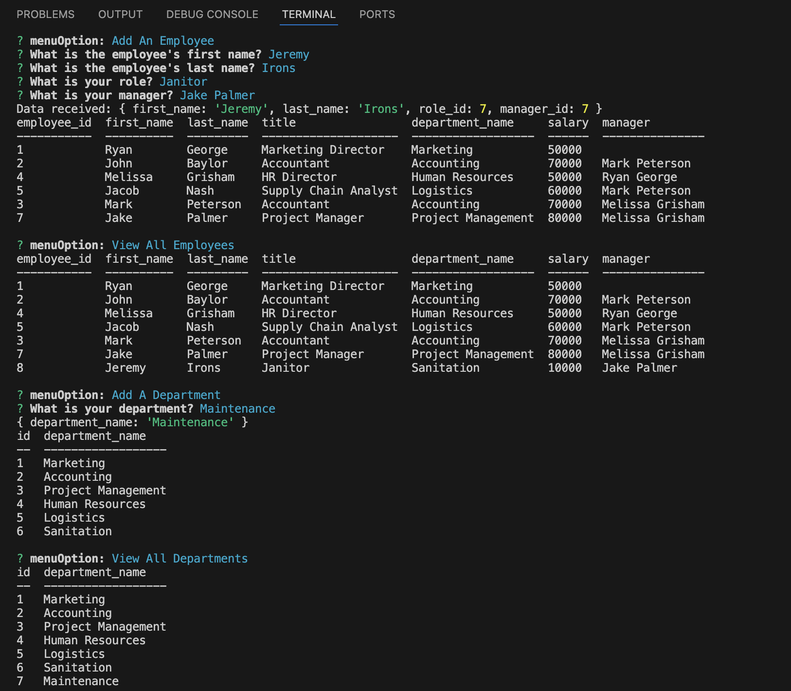

# Module 12 - Employee Tracker

For this assignment, I created an employee tracker database with the following functionalities:

### PostgreSQL Database

- Inside schema.sql, I created the "employees_db" with the "departments", "roles" & "employees" tables - possessing the necessary information and the proper foreign keys to reference separate data points.
- Inside seeds.sql, I seeded dummy data inside "employees_db" within the previously stated tables.
- Inside query.sql, I created a query statement to translate role_id, manager_id & department_id into their respective names & format the data into the table (seen in the walkthrough video).

### Index.JS
- After installing the necessary node packages and following best practices (creating a .gitignore to avoid passing local node_modules folder up to GitHub)
- I utilized inquirer & pg packages to store my database info and pool.connect statements to initialize the database and wait for the incoming userData from the following js files. 

### Queries.JS
- After referencing the same database found in my index.js, I created the query statements that get referenced inside "Inquirer.js" to format the user's results inside my SQL files.

- Each of the options references one or both of the following functions:
    - getAll... async functions = call the database table the necessary information will be passed into.
    - add...Data async functions = using INSERT statements to add the user results from "Inquirer.js" into the called database table.

- Exported all of these out of the file into... 

### Inquirer.JS
- After calling in inquirer & ctable (to format my table better), I imported the functions from "Queries.js" and created the following inquirer chain:

  - "View All Employees"
  - "View All Roles"
  - "View All Departments"
  - "Add An Employee"
  - "Add A Department"
  - "Add A Role"
  - "Update An Employee Role"

- Start function would called all seven of these string values as menuOptions, followed by if-else statements, filtering out each statement based on user input.

- Each menu option possessing their own inquirer statements and passing in their own data.

- Once the user entered in the data for the selected field, the "main menu" for the employee tracker would present itself.

- If a user enters data within:
    - "Add An Employee"
    - "Add A Role"
    - "Add A Department"
- The user will need to select:
    - "View All Employees"
    - "View All Roles"
    - "View All Departments"
- in order to view the additions to each selection.

## Link to Deployed Version

[Click here to see the deployed version](https://drive.google.com/file/d/1B0VMSuXWRdaXB7zYikrU-JbINRNX4oBR/view)

## Screenshot of the Deployed Version

